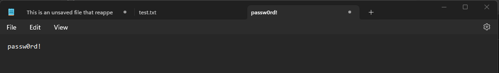
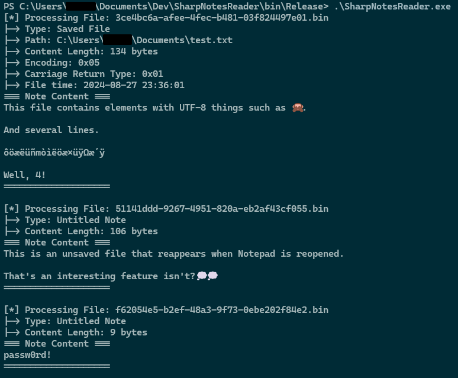

# SharpNotesReader
`SharpNotesReader` is a tool designed to **extract unsaved notes from Windows 11's Notepad** (`Notepad.exe`) session files. This feature allows quick-typed notes to persist even after the application is closed and reopened later. The tool lets you retrieve and read those unsaved files, providing insight into the hidden "`TabState`" files Notepad uses.

Many users rely on Notepad for tasks like quickly jotting down passwords or short notes:

With a bit of trickery and a few lines of code, you can look into the stored note data located at `%localAppData%\Packages\Microsoft.WindowsNotepad_8wekyb3d8bbwe\LocalState\TabState` and extract the content:

## Build Instruction
Open the solution (`.sln`) file with `Visual Studio`, and build the solution (`F7`). Executable will be located at `SharpNotesReader\bin\Release\SharpNotesReader.exe`. 

## In-Memory
Since disk is as "floor is lava", the binaries produced using `C#` are, by their inherent design, _de facto_ in-memory executables. This characteristic makes them highly versatile and powerful for stealthy execution without touching the disk.

## TODO
The only remaining enhancement for `SharpNotesReader` is support for reading active unsaved chunks in real-time. Currently, the tool requires Notepad to be closed before it can retrieve "proper" notes from the binaries files.